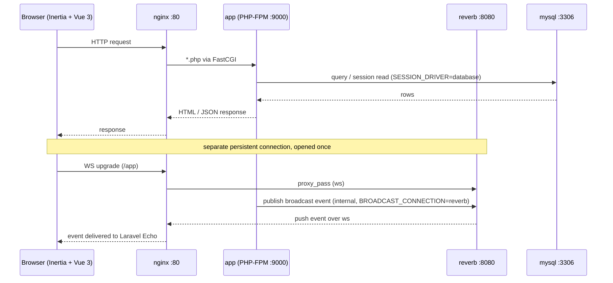
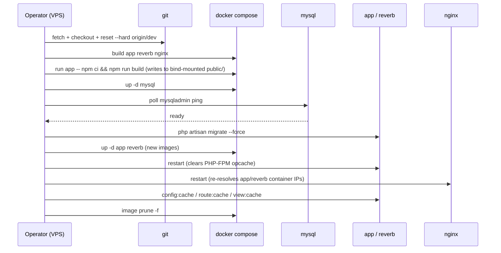

# System Architecture & Deploy Sequence

Snapshot of what `docker-compose.prod.yml`, `Dockerfile`, `deploy/`, and
`bootstrap/app.php` actually describe today (branch `dev`, 2026-08-15).
Companion to [production-deployment.md](./production-deployment.md) and
[vps-deployment-specs.md](./vps-deployment-specs.md) — see the **Docs drift**
note at the bottom before following either of those.

Stack: Laravel 12 (PHP 8.3) + Inertia/Vue 3, MySQL 8, Laravel Reverb
(WebSocket), nginx 1.27, four-container Docker Compose stack on one VPS.

---

## 1. Request & broadcast sequence

Nginx is the only public entry point. It forks by request type: `*.php`
goes to PHP-FPM over FastCGI, `/app` (the Echo/Pusher endpoint) is proxied
to Reverb over WebSocket. The app is the only service that talks to MySQL,
including for sessions (`SESSION_DRIVER=database`), and publishes broadcast
events to Reverb internally (`BROADCAST_CONNECTION=reverb`).

---

## 2. Deployment topology

| Service | Container port | Host port (prod) | Reachable from |
|---|---|---|---|
| nginx | 80 | 80 | public internet |
| app (php-fpm) | 9000 | — | compose network only (nginx) |
| reverb | 8080 | — | compose network only (nginx proxies `/app`) |
| mysql | 3306 | — | compose network only; SSH tunnel for direct access |

- **Bind-mount deploy model**: `app` and `reverb` bind-mount the whole repo
  (`.:/var/www`), so a `git pull`/`reset --hard` on the host ships backend
  code with no image rebuild. `nginx` only bind-mounts `public/` read-only
  plus the `storage_data` volume (read-only, so the `public/storage` symlink
  resolves).
- **Named volumes**: `mysql_data` (DB files), `storage_data` (uploads/logs —
  read-write for `app`/`reverb`, read-only for `nginx`), `bootstrap_cache`
  (compiled config/route cache, read-write for `app`/`reverb`).
- **systemd** (`deploy/systemd/etec-system.service`) runs
  `docker compose -f docker-compose.prod.yml up -d` on boot — the outer
  safety net for a VPS reboot, on top of each container's own
  `restart: always`.
- **No TLS in this compose file** — nginx serves plain HTTP on `:80` only, no
  `:443`. TLS either terminates upstream of this stack or isn't configured
  yet.
- **Dev stack differs**: `docker-compose.yml` (dev target) additionally
  exposes `mysql` on host `3307`, Vite on `5173`, and adds a `phpmyadmin`
  container on `8081` — none of that exists in prod.

---

## 3. Deploy pipeline sequence

`deploy/deploy.sh`, run from `/opt/etec-system` on the VPS — ten steps,
strictly in order.

Two steps exist only because of how the stack is wired, not by accident:

- **Frontend rebuilt a second time, onto the host** — the image's own
  `npm run build` (during `docker compose build`) gets shadowed at runtime
  because `app`/`nginx` bind-mount the host repo over it. Without the
  explicit host-side rebuild, frontend changes would never actually reach
  traffic.
- **Explicit restart of `app`/`reverb` after `up -d`** —
  `opcache.validate_timestamps=0` (`deploy/php/opcache.ini`) means PHP-FPM
  keeps serving whatever it already compiled into shared memory regardless
  of what changed on disk; `up -d` alone only recreates a container when its
  image/config changed, which a bind-mount code update doesn't trigger.

---

## 4. Notes & gaps

**Scheduler is registered but nothing runs it in production.**
`bootstrap/app.php` defines a real schedule via `->withSchedule()`:
`AutoRecordAttendanceCommand` every minute, `GenerateClassSessionsCommand`
daily at `00:05`, and an attendance digest later in the day — all timezoned
to `Asia/Phnom_Penh`. Laravel's scheduler only fires if something calls
`schedule:run` every minute (cron) or runs `schedule:work` continuously.
Neither `docker-compose.prod.yml`, `etec-system.service`, nor the production
Dockerfile stage does either — the prod image's only process is `php-fpm`.
Worth confirming whether these commands are actually firing in production.

**No queue worker in prod** — `QUEUE_CONNECTION=sync`, so jobs run inline on
the request thread; there's no `queue:work` process to begin with, which is
consistent with the compose file having no such container.

**Docs drift**: `docs/production-deployment.md` and
`docs/vps-deployment-specs.md` describe an earlier/aspirational version of
this stack — dedicated `queue` and `scheduler` containers, a host-level
nginx + Certbot in front for TLS, deploying from a `production` branch via
`.env.production.example`. None of that matches the current
`docker-compose.prod.yml` (bind-mount model, `dev` branch, single in-Docker
nginx on `:80` only, no queue/scheduler containers). Worth reconciling those
docs with the current compose file, or updating the compose file to match
the documented intent — right now they describe two different systems.
