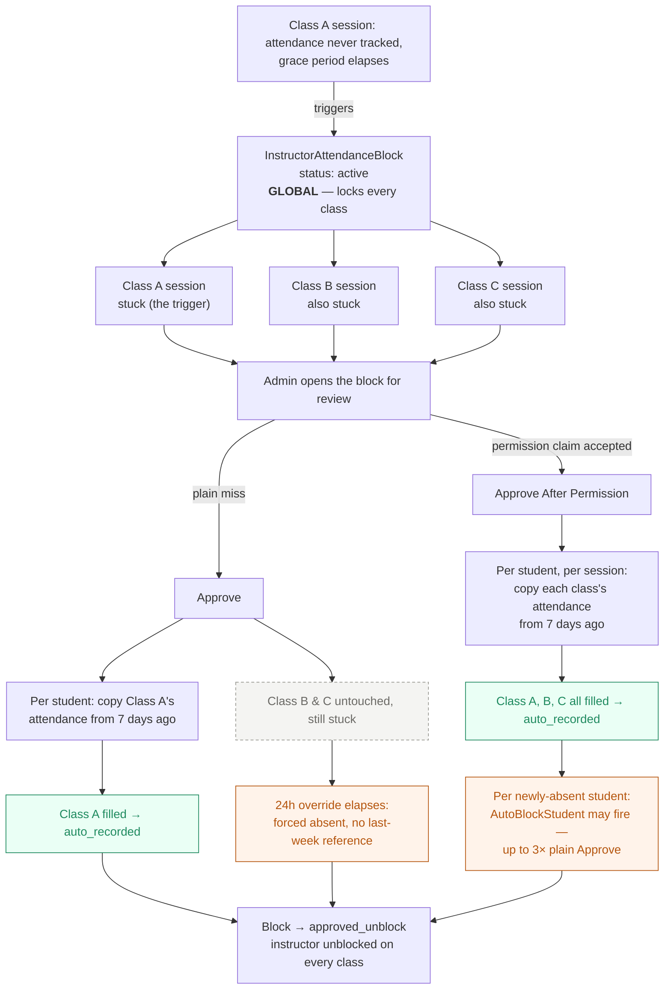

# Instructor Attendance Block — "Approve After Permission" button

Status: **Proposal — not implemented.**

## The problem

An `InstructorAttendanceBlock` is global — one missed session locks the instructor out of
tracking attendance on **every** class, not just the one that triggered it. Today there's no way
for the instructor to say "I missed this because I had approved permission/leave," and no way for
the admin to resolve the whole pile of sessions that built up during that time — only the one
triggering session gets backfilled.

## The fix

Add a second button next to today's **Approve**, and let the instructor state a reason when
requesting to be unblocked:

- **Approve** (existing, unchanged) — for a plain one-off miss. Backfills only the triggering
  session from last week's attendance, same as today.
- **Approve After Permission** (new) — for when the admin accepts a leave/permission
  explanation. Backfills **every** session still stuck across **all** the instructor's classes,
  not just the one shown on the block.

## Flow

## What needs to be built

- **DB**: `unblock_reason_type` on `instructor_attendance_blocks` (instructor's claim: general /
  permission), plus `reviewed_reason_type` (what the admin actually approved under).
- **Instructor side**: reason picker on the existing "Request to track again" button
  (`InstructorDashboard.vue` / `requestAttendanceUnblock`).
- **Admin side**: second button on `instructor-attendance-blocks/Index.vue`, new
  `BackfillAllMissedSessionsFromLastWeek` action (sessions where `teacher_id` = instructor,
  status `pre_attendance`/`partial`, `session_date <= blocked_at`), wired into
  `ApproveInstructorAttendanceBlock` alongside the existing single-session path.

## Known risk — read before building

"Approve After Permission" runs the backfill N times in one click instead of once:

- Each newly-absent student can trigger `AutoBlockStudent` (a separate student-lock system) —
  clicking once could cascade into several student locks at once. Accepted as-is: plain Approve
  already carries this same risk today at smaller scale, so this isn't new behavior to guard
  against, just wider.
- No queuing exists for this today (`QUEUE_CONNECTION=sync`); a large backlog means N row locks
  and N writes held open in one synchronous request. Decide whether to cap/chunk/queue this before
  implementing.

## Implementation prompt (for opencode)

Copy everything below into opencode (`@docs/instructor-attendance-block-approve-after-permission.md`).

---

Implement the "Approve After Permission" feature for instructor attendance blocks in this Laravel + Vue (Inertia) repo. Full context and the agreed design are in the sections above this prompt — read them first, they include a flowchart of the exact mechanism.

### Current behavior (do not break this)
- app/Modules/Attendance/Actions/BlockInstructorForMissedAttendance.php creates/escalates an InstructorAttendanceBlock (app/Models/InstructorAttendanceBlock.php) when a session goes untracked. The block is GLOBAL — it locks the instructor out of tracking attendance on every class they teach (enforced via app/Modules/Attendance/Queries/FindActiveInstructorAttendanceBlock.php), not just the class that triggered it.
- app/Modules/Attendance/Actions/ApproveInstructorAttendanceBlock.php is the current "Approve" action: flips the block to approved_unblock and calls app/Modules/Attendance/Actions/AutoFillTriggeringSessionFromLastWeek.php to backfill ONLY the one triggering ClassSession from that session's own last-week attendance (per student, per-student absence-lock + permission-quota checks apply, defaults to absent if no prior-week row exists).
- Instructor-facing "request to track again": app/Modules/Instructor/Services/InstructorClassService.php::requestAttendanceUnblock() (~line 175), wired via app/Modules/Instructor/Controllers/InstructorClassController.php and routes/web/backend/instructor.php, UI in resources/js/pages/backend/InstructorDashboard.vue (~line 56-65, 222-230).
- Admin review list: resources/js/pages/backend/instructor-attendance-blocks/Index.vue, backed by app/Modules/Attendance/Controllers/InstructorAttendanceBlockController.php and routes/web/backend/instructor-attendance-block.php.
- instructor_attendance_blocks table: database/migrations/2026_09_13_000001_create_instructor_attendance_blocks_table.php.

### What to build

1. Migration: add nullable `unblock_reason_type` enum('general','permission') and `reviewed_reason_type` enum('general','permission') to instructor_attendance_blocks.

2. Instructor side: extend requestAttendanceUnblock() to accept a reason type ('general' default, or 'permission'), store it as unblock_reason_type. Add a simple reason picker to the "Request to track again" UI in InstructorDashboard.vue (checkbox or two-option choice — your call on exact UI, keep it minimal).

3. New action app/Modules/Attendance/Actions/BackfillAllMissedSessionsFromLastWeek.php: finds every ClassSession where the owning StudyClass.teacher_id = the instructor, status IN ('pre_attendance','partial'), session_date <= the block's blocked_at. For each, runs the SAME per-student fill logic as AutoFillTriggeringSessionFromLastWeek (don't duplicate it — refactor the per-session fill body out of AutoFillTriggeringSessionFromLastWeek into a shared method both actions call).

4. ApproveInstructorAttendanceBlock: keep the existing single-session path as-is for plain "Approve". Add a second entry point / flag that calls the new all-sessions backfill for "Approve After Permission", and records reviewed_reason_type accordingly.

5. Two endpoints: keep POST .../approve unchanged; add POST .../approve-after-permission routed to the new path. Add the second button to Index.vue with its own confirm dialog (accurate copy — it backfills every stuck session across all their classes, not just one) plus a small badge showing the instructor's stated unblock_reason_type when present.

### Performance — this is the part that needs real care

Approve After Permission can touch many sessions in one HTTP request (an instructor blocked for days across many classes). Design for that from the start, not as an afterthought:

- No N+1 queries. Batch-load: all candidate sessions in one query (with the enrolled students / existing attendance rows for their dates), all last-week attendance rows in one query keyed by (study_class_id, student_enrollment_id, date), not one query per session per student. Build in-memory lookups (keyed collections) instead of querying inside the per-session/per-student loop.
- Use bulk writes. Replace the per-row updateOrInsert-in-a-loop pattern with a chunked bulk upsert (DB::table('student_attendances')->upsert([...], uniqueBy, updateColumns)) where possible, instead of one query per student.
- Keep transactions short. Don't hold one giant transaction with row locks across every session in the backlog for the whole request — process in reasonably sized chunks (e.g. 50-100 sessions per transaction) so lock hold time and rollback blast radius stay bounded. Flag clearly in code comments/PR description if you decide a single outer transaction is still correct for atomicity reasons.
- Decide and document a threshold: if the sweep would touch more than some N sessions (pick something sane, e.g. 100), either process synchronously in chunks with the above safeguards, or dispatch as a queued job (ShouldQueue) and have the admin UI show "processing" instead of blocking the request — there is no existing queued-job precedent in app/Modules/Attendance or app/Modules/AbsenceBlock, so this would be new; make the call based on realistic backlog size, and state your reasoning.
- AutoBlockStudent (app/Modules/AbsenceBlock/Actions/AutoBlockStudent.php) fires once per newly-absent student per session — with a wide sweep this can run many times in one request. Don't defer or batch its actual locking logic (that's a separate system with its own correctness rules — leave it alone), just be aware it's the dominant cost per session and make sure your batching of the attendance-write side doesn't accidentally serialize unnecessary queries around it.
- Add an index if needed for the sweep query (study_classes.teacher_id + class_sessions.status + session_date) — check existing indexes first before adding a redundant one.

### Tests
- Plain Approve still only touches the triggering session (regression guard).
- Approve After Permission backfills every stuck session across all classes, respects session_date <= blocked_at scoping, no-op when nothing is stuck.
- Bulk-write path produces identical per-row results to the old per-row loop (absence-lock and permission-quota edge cases still respected).
- A rough perf/query-count assertion (e.g. assertQueryCountLessThan or similar) on the sweep so a future change can't silently reintroduce N+1 queries.
