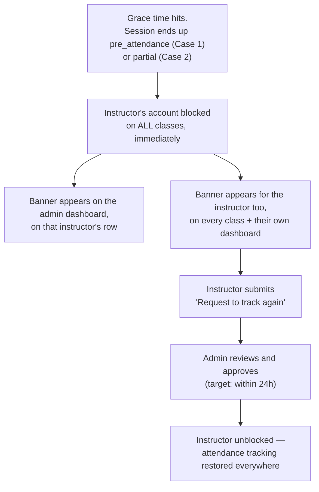

# Instructor Attendance Block — Design Proposal

**Status: proposal, not implemented.** Nothing described here exists in the codebase yet.

Simple version, in your own words: two cases, same outcome.

- **Case 1** — instructor forgets attendance completely → system auto-records → instructor is
  blocked from tracking attendance on **every** class, not just this one.
- **Case 2** — instructor records *some* students but not all (e.g. 8 of 10, 2 missing) → same
  block, same everywhere-blocked outcome.

Both cases end the same way: a banner shows on the admin's dashboard next to that instructor,
the instructor requests to track again, and an admin approves it.

---

## Case 1 — complete no-show

**Trigger:** grace period passes (see `docs/auto-record-attendance-workflow.md`), **0 students
tracked**. `AutoRecordSession` already classifies this as `pre_attendance` today — that
classification *is* the trigger, no new check needed.

**Effect:** instructor's account is blocked from tracking attendance on **any** class they
teach, immediately. Not just the class that caused it.

---

## Case 2 — partial no-show

**Trigger:** grace period passes, **some but not all students tracked** (e.g. 8 of 10 — the
numbers are just an example, this works the same for any count). `AutoRecordSession`
classifies this as `partial` today — same trigger point as Case 1, just the other branch of the
same check:

```php
// AutoRecordSession.php — already in the codebase
'status' => match (true) {
    $trackedCount === 0 => STATUS_PRE_ATTENDANCE,              // Case 1
    $trackedCount < $enrollments->count() => STATUS_PARTIAL,   // Case 2
    default => STATUS_AUTO_RECORDED,                            // fully tracked in time, no block
},
```

**Effect:** identical to Case 1 — instructor blocked on every class. The students already
tracked (8 of 10) are never touched or invalidated; only the instructor's ability to submit
*more* attendance going forward is blocked. The still-missing students (2 of 10) get finalized
to `absent` after 24h by the existing `FinalizeAutoRecordedSession` job if nobody completes
them first — that part of the system doesn't change.

---

## The flow (same for both cases)



- **No auto-expiry.** The block never lifts by itself. Only an admin approval unblocks it —
  the 24h is how fast an admin is expected to act, not a timer the system enforces.
- **One request is enough**, regardless of whether it was Case 1 or Case 2, and regardless of
  how many classes or students were involved.

---

## Where the banner shows

1. **Admin dashboard — instructor list** (`/dashboard/users`, `UserController::index`, the same
   table admins already use to manage users). Any instructor with an active block gets a flag
   on their row, e.g. "⚠ Attendance blocked — request pending," so an admin sees it without
   opening anyone's profile.
2. **Instructor's own dashboard** (`GET /dashboard`, `routes/web/backend/dashboard.php:15` →
   `backend/InstructorDashboard.vue`) — a top banner the moment they log in, plus a flag on the
   specific class row that caused it.
3. **Every class's attendance page** the instructor opens while blocked — same banner, naming
   the class that caused it either way (using the **course name**, e.g. "Basic IT," not the
   class's own internal `title`).

---

## Minimal schema — `instructor_attendance_blocks`

```
id
instructor_id            -> users.id
triggered_by_session_id  -> class_sessions.id
reason                   string
status                   enum: active | pending_review | approved_unblock | rejected
blocked_at               datetime
unblock_requested_at     datetime  nullable
reviewed_by              -> users.id  nullable
reviewed_at              datetime  nullable
note                     text nullable
```

One row per instructor while a block is active — a new incident just refreshes the same row's
`reason` / `triggered_by_session_id` rather than creating duplicates.

---

## Where it's enforced (real files)

- `InstructorClassService::saveAttendance()` — one guard at the top, blocks both
  `storeAttendance` and `overrideAttendance` (`InstructorClassController.php:540,567`).
- `InstructorClassController::preAttendance` / `::requestPreAttendance` — same guard, or the
  block is bypassable through this screen.
- New action: `Actions/BlockInstructorForMissedAttendance.php`, called from
  `AutoRecordSession` right when it classifies a session as `pre_attendance` or `partial`.
- New endpoint: `POST /dashboard/instructor/attendance-block/request` — instructor's
  self-service request.
- New admin page mirroring `AbsenceBlockController`'s approve/reject pattern, gated
  `role:super_admin|admin` (same as `routes/web/backend/absence-block.php:23`).

---

## Known edge case — Collapse Class

A class shared between two instructors (`study_class_instructors`) only blocks **whoever was
assigned to that session** (`class_sessions.instructor_id`). The co-instructor keeps full,
unaffected access — including, per existing code, the ability to submit attendance for the
blocked instructor's day too, since `saveAttendance()` doesn't check per-session ownership
today. Flagging this as-is rather than solving it here; it's a pre-existing permission gap, not
something new this feature introduces.

---

## Not now — to discuss later

This doc intentionally stops at "admin approves." What exactly happens *after* approval
(whether it also clears any still-`partial` session automatically, how that interacts with the
existing separate Pre Attendance approval at `InstructorClassService.php:501-505`, etc.) is a
separate conversation — not decided here yet.

## Open questions

1. Standalone module, or folded into the existing `AbsenceBlock` module?
