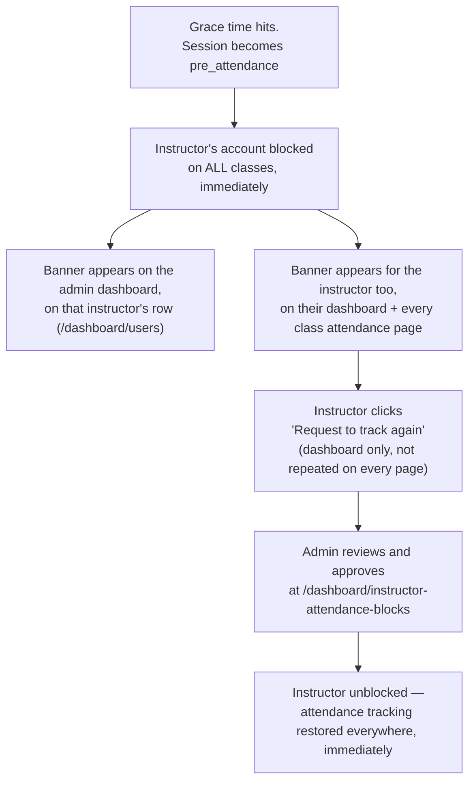

# Instructor Attendance Block — Design Proposal

**Status: implemented (Case 1 only), with one designed-but-not-yet-built change:** the
last-week auto-fill on block approval (see "The triggering session" section below) is decided but
not coded yet. Case 2 is intentionally deferred — see below.

Simple version, in your own words: two cases, one is wired up.

- **Case 1** — instructor forgets attendance completely → system auto-records → instructor is
  blocked from tracking attendance on **every** class, not just this one. **Implemented.**
- **Case 2** — instructor records *some* students but not all (e.g. 8 of 10, 2 missing) → was
  originally proposed to trigger the same block. **Deliberately not wired up** — see below.

Case 1 ends like this: a banner shows on the admin's dashboard next to that instructor, the
instructor requests to track again, and an admin approves it with one click.

---

## Case 1 — complete no-show

**Trigger:** grace period passes (see `docs/auto-record-attendance-workflow.md`), **0 students
tracked**. `AutoRecordSession` classifies this as `pre_attendance` — that classification *is* the
trigger.

**Effect:** instructor's account is blocked from tracking attendance on **any** class they teach,
immediately. Not just the class that caused it.

---

## Case 2 — partial no-show — deferred, not blocking

**Trigger:** grace period passes, **some but not all students tracked**. `AutoRecordSession`
classifies this as `partial` — same trigger point as Case 1, just the other branch of the same
check:

```php
// AutoRecordSession.php — current code
$status = match (true) {
    $trackedCount === 0 => STATUS_PRE_ATTENDANCE,              // Case 1 — blocks the instructor
    $trackedCount < $enrollments->count() => STATUS_PARTIAL,   // Case 2 — does NOT block
    default => STATUS_AUTO_RECORDED,                            // fully tracked in time, no block
};

// Only fires on the transition into pre_attendance, not on every scheduler re-run
// while the session is still stuck there (see the "everyMinute() gotcha" below).
if ($status === STATUS_PRE_ATTENDANCE && ! $wasAlreadyPreAttendance) {
    $this->blockInstructor->handle($session);
}
```

**Decision:** this was built as Case 1 only, on purpose — a deliberate scope cut, not an
oversight. A `partial` session is **not** blocked instructor-wide. The only control on it is the
pre-existing, separate per-session approval gate (see "What happens after approval" below),
unchanged from before this feature existed. The still-missing students get finalized to `absent`
after 24h by
the existing `FinalizeAutoRecordedSession` job if nobody completes them first.

If Case 2 blocking is wanted later, it's a one-line change: add `STATUS_PARTIAL` to the
`in_array` check in `AutoRecordSession::handle()`.

---

## The flow (Case 1)



- **No auto-expiry.** The block never lifts by itself. Only an admin approval unblocks it.
- **No reject action.** An admin who doesn't want to unblock someone just doesn't click Approve —
  there's nothing a separate reject state adds. (Originally scaffolded with reject +
  `STATUS_REJECTED`; removed after review — see "Decisions made along the way" below.)
- **One request is enough.** A repeat incident refreshes the same row (same instructor, same
  block) rather than creating a duplicate — see the schema note below.

---

## What happens after approval — resolved

This was originally left as "not decided yet." It's now resolved:

**Approving the block is immediate and global.** The moment `ApproveInstructorAttendanceBlock`
sets the row to `approved_unblock`, `FindActiveInstructorAttendanceBlock` returns `null` for that
instructor, and every guard that checks it (`InstructorClassService::saveAttendance()`,
`OverrideAttendanceRecord::handle()`) stops rejecting immediately. The instructor can track
attendance on any class right away — no delay, no second step.

**Approving the block does NOT auto-approve the specific stuck session.** This is the part that
was ambiguous. There are two independent gates, not one:

1. **Attendance Block** (this feature) — can the instructor track attendance *at all*, anywhere.
2. **Pre-attendance approval** (pre-existing, separate, unchanged by this feature) — even an
   unblocked instructor still can't submit attendance for a session sitting in
   `pre_attendance`/`partial` status unless there's an approved `PreAttendanceRequest` row for
   that exact session (`InstructorClassService::saveAttendance()`, the
   `$canCompletePreAttendance && ! $approvedPreAttendanceRequest` check, ~line 400).

**Decision: keep them separate, don't fold them together.** Reasoning: gate 2 is the *only*
control on Case 2 (`partial`) sessions, which are never touched by the instructor-wide block at
all. Auto-approving gate 2 whenever gate 1 clears would mean any `partial` session becomes freely
completable with zero admin oversight, since it was never blocked to begin with. So: after a
block approval, the instructor can track attendance normally going forward on every *other*
class. The specific session that caused the block is handled differently — see the next section.
It's **not** just "another Pre-Att Class approval, then the instructor fills it in" — that part
has changed.

---

## The triggering session: auto-fill from last week, don't let the instructor re-track it

**New decision, refines the section above.** Originally the plan was: block approval clears gate
1, and the triggering session still goes through the normal Pre-Att Class → instructor
manually re-tracks it flow, same as any other stuck session. **Rejected on review** — a
retroactive manual entry for the exact class that caused the block can't be trusted: the
instructor who forgot (or avoided) tracking on time is now the one being asked, after the fact,
to say who was present. There's no way to verify it, and the incentive to mark everyone "present"
is obvious.

**Decided instead:** when admin approves the block, the system auto-fills that one triggering
session itself — the instructor never gets a form to fill in for it.

- **Scope:** only `triggered_by_session_id` on the block being approved. Every other stuck
  session (Case 2 partials, or any other class an admin reviews from Pre-Att Class) is
  untouched by this — that page keeps working exactly as it does today.
- **Fill rule:** for every active enrollment with **no existing `student_attendances` row** for
  that date, copy that student's status from the same class's session exactly one week earlier
  (same `study_class_id`, `session_date - 7 days`). This is written generically ("fill whatever's
  missing"), so it also covers a partial session cleanly if this is ever pointed at one later —
  today the triggering session is always a complete no-show (0 tracked), so in practice every
  enrollment gets filled.
- **No prior-week record for a student** (new enrollment, or last week was itself unresolved):
  **fall back to `absent`** — same conservative default the system already uses elsewhere
  (`FinalizeAutoRecordedSession`), never fabricate a "present" out of nothing.
- **Still subject to lock rules.** A student under an active absence-block lock must still come
  out `absent` with the lock reason, never silently copied to "present" just because last week's
  record happened to say so — same as every other attendance-writing path
  (`AbsenceBlockEvaluator`).
- **Resulting session status: `auto_recorded`, not `recorded`.** This reuses the existing
  "system-generated, not instructor-submitted" state and its existing corrective path — instructor
  can no longer freely resubmit this session (`saveAttendance()` already rejects a plain resubmit
  on an `auto_recorded` session), only request a correction through the existing, audited
  `OverrideAttendanceRecord` flow, same as any other auto-recorded class.
- New rows should be flagged `source = auto` (`StudentAttendance::SOURCE_AUTO`), the same source
  value `FinalizeAutoRecordedSession` already uses for its own system-generated rows — so an
  auditor can tell these apart from a genuine manual entry.

This is **not implemented yet** — documented here first per request, code to follow separately.

---

## Where the banner shows

1. **Admin dashboard — instructor list** (`/dashboard/users`). Any instructor with an active
   block gets a "⚠ Attendance blocked" badge on their row (`UserService::presentUser()`, via the
   `User::activeAttendanceBlock()` relation).
2. **Instructor's own dashboard** (`GET /dashboard` → `backend/InstructorDashboard.vue`) — a top
   banner with the reason and a **"Request to track again"** button (only shown once, here — not
   repeated on other pages), plus a highlighted ring + "Caused the block" tag on the specific
   class card.
3. **Every class's attendance page** the instructor opens while blocked
   (`backend/instructors/AttendanceRecord.vue`) — same banner text and reason, **no button** (the
   dashboard already has it). Naming the class using the **course name** (e.g. "Basic IT"), not
   the class's own internal `title` — though in practice these are usually the same string, since
   a class's `title` always mirrors its course's `title` at creation time
   (`InstructorClassController::store()`).
4. The actual tracking form (`trackAttendance()`) is never reached while blocked — it redirects
   back to the class's attendance page with a warning instead.

---

## Minimal schema — `instructor_attendance_blocks`

```
id
instructor_id            -> users.id
triggered_by_session_id  -> class_sessions.id  nullable
reason                   string
status                   enum: active | pending_review | approved_unblock
blocked_at               datetime
unblock_requested_at     datetime  nullable
reviewed_by              -> users.id  nullable
reviewed_at              datetime  nullable
note                     text nullable
```

No `rejected` status (removed — see below). "Blocking" statuses = everything except
`approved_unblock`, i.e. `[active, pending_review]`.

One row per instructor while a block is outstanding — a new incident (`BlockInstructorForMissedAttendance`)
just refreshes the same row's `reason` / `triggered_by_session_id` / `blocked_at`, and resets
`status` back to `active`, rather than creating a duplicate. Once approved (`approved_unblock`),
the row is no longer "active" for lookup purposes, so a genuinely new future incident starts a
fresh row — keeping a history trail instead of overwriting an approved record.

---

## Where it's enforced (real files)

- `InstructorClassService::saveAttendance()` (~line 344) and `OverrideAttendanceRecord::handle()`
  (~line 29) — both check `FindActiveInstructorAttendanceBlock` and reject with the same message
  before doing anything else. Covers `storeAttendance`, `overrideAttendance`, and the pre-attendance
  re-track path (they all funnel through `saveAttendance()`, except override which has its own
  action class).
- `InstructorClassController::trackAttendance()` — checks the block early and redirects back with
  a warning rather than rendering the tracking form at all.
- `BlockInstructorForMissedAttendance` — called from `AutoRecordSession::handle()` only on the
  transition into `pre_attendance` (not on every scheduler re-run while a session stays stuck
  there — `attendance:auto-record` runs `everyMinute()` and would otherwise re-fire this every
  minute, silently resetting an instructor's `pending_review` request, or even an admin's
  `approved_unblock`, back to `active`. This was a real bug found and fixed during testing).
- `POST /dashboard/instructor/attendance-block/request` (`InstructorClassController::requestAttendanceUnblock`)
  — instructor's self-service "request to track again," dashboard only.
- Admin review page: `/dashboard/instructor-attendance-blocks` (`InstructorAttendanceBlockController`),
  nested under the **Attendance** sidebar group (alongside Pre-Att Class, Pre-Att Count, and
  Attendance Settings). Lists every blocked instructor with a single **Approve** action — no
  reject. Gated `role:super_admin|admin`.

---

## Decisions made along the way

Things this doc originally left open, now settled through actual review:

- **No reject action.** Originally scaffolded with `RejectInstructorAttendanceBlock` +
  `STATUS_REJECTED`, mirroring `AbsenceBlockController`'s approve/reject pattern. Removed: an
  admin who doesn't want to approve just doesn't click anything — a reject state added no
  capability, only an extra click and an extra status to reason about.
- **Standalone module — not folded into `AbsenceBlock`.** Lives in
  `App\Modules\Attendance\...`, separate from `App\Modules\AbsenceBlock\...` (which handles
  *student* absence locks, a different concern).
- **The pre-existing "Pre-Att Request" review queue was removed** (not part of this feature, but
  removed during this work as a duplicate): admin's **Pre-Att Class** page already lists every
  session stuck in `pre_attendance`/`partial` and can approve any of them directly
  (`PreAttendanceRequestController::approveClass()`), so instructors no longer have (or need) a
  separate "please review my class" self-service page. The underlying per-session approval
  mechanism itself was **not** touched — see "What happens after approval" above.

---

## Known edge case — Collapse Class

A class shared between two instructors (`study_class_instructors`) only blocks **whoever was
assigned to that session** (`class_sessions.instructor_id`). The co-instructor keeps full,
unaffected access — including, per existing code, the ability to submit attendance for the
blocked instructor's day too, since `saveAttendance()` doesn't check per-session ownership today.
Flagging this as-is rather than solving it here; it's a pre-existing permission gap, not something
new this feature introduces.
