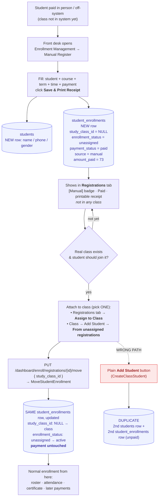
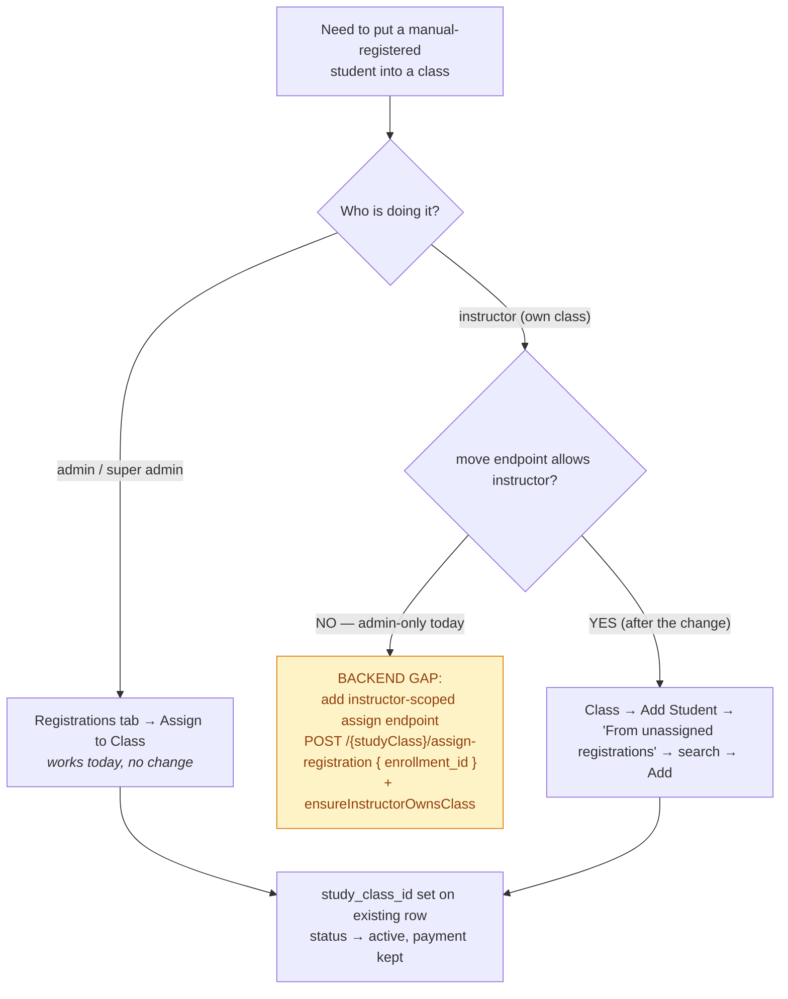

# Manual Register — flow & storage

**Feature:** *Enrollment Management → Manual Register*. Record a registration that
happened in the past / off-system, print a receipt, and later let an instructor
pull that student into their class. There is **no class to join** at record time.

---

## Status — the whole flow, end to end ✅

### 1. Manual Register  *(done)*

Front desk records the paid registration → creates a `students` row + a
**class-less `student_enrollments` row** (`source = manual`, `payment_status =
paid`, `study_class_id = null`, `enrollment_status = unassigned`). It shows in the
**Registrations** tab with a `[Manual]` badge and a printable receipt.

Backend: `POST /dashboard/enroll/manual-registrations`
(`EnrollmentClassController::storeManualRegistration` → `StoreManualRegistrationRequest`
→ `RecordManualRegistration`). No new table.

### 2. Instructor → "Add Existing Student"  *(done)*

1. Instructor logs in → dashboard → a class card → **⋮ menu → Add Existing Student**.
2. A modal lists **every unassigned registration** (Manual Register + other parked
   ones), searchable by name / phone / course. Each row: name, `[Manual]` badge,
   phone · course, term · payment status · amount paid.
3. Click **Add** → the student joins **this** class. Toast, row drops off the list,
   the card's seat count / progress bar ticks up.

| Layer | File / endpoint |
|---|---|
| Menu item | `resources/js/components/ui/card/ClassActionMenu.vue` — emits `assign-registration` |
| Modal | `resources/js/pages/backend/students/components/AssignRegistrationModal.vue` |
| Card wiring | `ClassCrad.vue` — renders the modal, bumps seats on `@assigned` |
| List | `GET /dashboard/enroll/{studyClass}/assignable-registrations?search=` → `assignableRegistrations()` |
| Assign | `POST /dashboard/enroll/{studyClass}/assign-registration { enrollment_id }` → `assignRegistration()` → `MoveStudentEnrollment` |

Both endpoints are in the `role:super_admin|admin|instructor` group and call
`ensureInstructorCanManageClassStudents()` — an instructor only sees / touches
their own classes. Assign rejects anything not still `study_class_id = null` +
`enrollment_status = unassigned`, `ensureClassAcceptsMutations()` blocks ended /
cancelled classes, and the seat check runs inside
`MoveStudentEnrollment::assignUnassigned()`.

The existing enrollment is **updated in place** — `study_class_id` set,
`enrollment_status → active`, **payment preserved, no duplicate student**.

> After deploy, run `php artisan route:clear` if route caching is on.

### ⚠️ The trap

Using the instructor's **plain "Add Student" / Register Student** button
(`CreateClassStudent`) for a manual student creates a **second** `students` row +
a second (unpaid) enrollment. Always attach via step 2 above, or the Registrations
tab's **Assign to Class**.

---

## Instructor side — exactly where it is

**UI path:** Instructor logs in → **Dashboard** → a class card → **⋮ menu** →
**"Add Existing Student"** → search modal → **Add**.

**Files that make it work:**

| # | File | Role |
|---|---|---|
| 1 | `resources/js/pages/backend/InstructorDashboard.vue` | Renders the instructor's class cards (`<ClassCrad>`). |
| 2 | `resources/js/components/ui/card/ClassCrad.vue` | The card. Holds `showAssignModal`, renders `<AssignRegistrationModal>`, `onRegistrationAssigned()` bumps the seat count. |
| 3 | `resources/js/components/ui/card/ClassActionMenu.vue` | The ⋮ menu. New item **"Add Existing Student"** → `emit("assign-registration")`. |
| 4 | `resources/js/pages/backend/students/components/AssignRegistrationModal.vue` | **The modal** — debounced search + list + per-row **Add** button. |
| 5 | `routes/web/backend/enroll.php` | Routes `enroll.class-students.assignable` (GET) + `enroll.class-students.assign` (POST), in the `role:super_admin\|admin\|instructor` group. |
| 6 | `app/Modules/Enroll/Controllers/EnrollmentClassController.php` | `assignableRegistrations()` (list) + `assignRegistration()` (do it) — both call `ensureInstructorCanManageClassStudents()`. |
| 7 | `app/Modules/Enroll/Actions/MoveStudentEnrollment.php` | `assignUnassigned()` — sets `study_class_id` on the existing enrollment, checks the seat. *(existing, reused)* |

**Requests the browser makes:**

```
GET  /dashboard/enroll/{studyClass}/assignable-registrations?search=Dara
POST /dashboard/enroll/{studyClass}/assign-registration   { "enrollment_id": 42 }
```

Nothing on the instructor dashboard hides this menu item — `hiddenItems()` in
`InstructorDashboard.vue` only strips *Copy Class* / *Switch Teacher* /
owner-only actions.

---

## User stories (step by step)

### Story A — Record an off-system registration

> **As a** front-desk admin
> **I want to** enter a student who already paid in person for a course
> **so that** they're on record with a receipt, even before their class exists.

1. Admin opens **Enrollment Management** → clicks the **Manual Register** tab.
2. The form opens immediately (no class picker).
3. Admin fills **Student**: Full Name, Phone, Gender.
4. Admin fills **Course info**: Course (dropdown of all courses), Term / Days
   (Mon & Thu · Sat & Sun · Sunday · Saturday), Time — picks a Start; End
   auto-fills to +1h and can be dragged to any length.
5. Admin fills **Payment**: Amount Paid, Discount, Document Price (pre-filled 5),
   Payment Method, Payment Date (the day money changed hands), optional Note.
6. Admin clicks **Save & Print Receipt**.
7. **System:** validates → `POST /dashboard/enroll/manual-registrations` →
   creates the student + a class-less `student_enrollments` row
   (`source = manual`, `payment_status = paid`, `study_class_id = null`) → returns
   `201`.
8. **System:** toast *"Registration saved successfully"*, receipt opens in the
   print dialog, form resets.
9. Admin can now see the student in **Registrations → Table / Card** with a
   `[Manual]` badge, *Paid*, and a re-printable receipt. **Not in any class yet.**

*Alt 6a:* Admin clicks **Save** (no print) → same, form just resets.
*Alt 7a:* validation fails → red field errors, nothing saved.

---

### Story B — Instructor pulls that student into their class

> **As an** instructor
> **I want to** add an already-registered student to my class from a searchable list
> **so that** I don't re-type them or create a duplicate, and their payment stays attached.

1. Instructor logs in → lands on their **dashboard** (their classes as cards).
2. On the right class card, instructor clicks the **⋮ (three-dot) menu**.
3. Instructor clicks **Add Existing Student**.
4. **System:** modal opens and calls
   `GET /dashboard/enroll/{class}/assignable-registrations` → shows every
   *unassigned* registration (Manual + other parked), newest first.
5. Instructor types the student's **name / phone / course** in the search box.
6. **System:** debounced (350 ms) re-query; list narrows. Each row shows: name,
   `[Manual]` badge, phone · course, term · *Paid* · `$amount`.
7. Instructor clicks **Add** on the matching row.
8. **System:**
   `POST /dashboard/enroll/{class}/assign-registration { enrollment_id }` →
   `ensureInstructorCanManageClassStudents()` (must be their class) → checks the
   row is still `unassigned` → checks the class has a free seat →
   `MoveStudentEnrollment` sets `study_class_id` on the **existing** enrollment,
   `enrollment_status → active`, payment untouched.
9. **System:** toast *"Dara added to Basic IT"*, the row disappears from the list,
   the card's **seat count / progress bar increments**.
10. Instructor closes the modal. The student is now in the roster, attendance,
    scoring, certificates — a normal enrolled student.

*Alt 4a:* no unassigned registrations → *"No unassigned registrations right now."*
*Alt 8a:* class is full → error toast, row stays; instructor bumps capacity first.
*Alt 8b:* someone already assigned that row → *"That registration is already
assigned to a class."*, list refreshes.
*Alt (not their class):* instructor never sees other teachers' classes, and the
endpoint 403s if forced.

---

### Story C — Admin assigns from the Registrations tab (equivalent path)

> **As an** admin
> **I want to** assign a parked registration to a class without opening the class card.

1. Admin opens **Enrollment Management → Registrations**.
2. Finds the `[Manual]` / unassigned row → clicks **Assign to Class**.
3. Picks the target class → confirms.
4. **System:** `PUT /dashboard/enroll/registrations/{enrollment}/move
   { study_class_id }` → same `MoveStudentEnrollment` in-place assignment as
   Story B step 8.
5. Row now shows the class; payment kept.

---

## Flowchart — the whole lifecycle



## Flowchart — "attach later" decision



> **List source:** the "unassigned registrations" list = `student_enrollments`
> rows with `study_class_id = NULL` (Manual Register entries **+** other parked
> registrations). Searchable by name / phone / course. Not "every student".

---

## 1. What the form collects

```
Student:   full_name, phone, gender            (khmer_name field is hidden)
Course:    course (title str), term (str), time_start / time_end
Payment:   amount_paid*, discount, document_price (def 5),
           payment_method (Cash…), payment_date, note
```

## 2. What ships today (minimal)

`RecordManualRegistration` writes:

| Table | Row |
|---|---|
| `students` | full_name, gender, phone |
| `student_enrollments` | `study_class_id = null`, `enrollment_status = unassigned`, `payment_status = paid`, **`source = manual`**, `course_id` (matched from title, else null), `term_id` (matched from name, else null), `time_id = null`, `fee_amount = amount_paid`, `document_fee_amount = document_price`, `amount_paid = amount_paid`, `enrolled_at = payment_date`, `paid_at = now()` |

**Dropped** (no columns): `discount`, `payment_method`, the raw `time` label,
`khmer_name`. They only appear on the printed receipt.

Good enough **if**: manual entries are rare one-offs, always paid in full in one
go, and accounting doesn't need method/discount in the DB.

---

## 3. The decision

Answer these, then pick an option:

| Question | If **yes** → |
|---|---|
| Can a manual registration be paid in **installments** (add payments later)? | Option C |
| Do you need **discount / payment method** stored for reports or audit? | Option B or C |
| Do you need to **re-print a numbered receipt** later? | Option B or C |
| Do you want manual payments in the **same report** as class deposits + online payments? | Option C |
| None of the above — it's just a historical note + one receipt? | Option A (ship as-is) |

---

## 4. Options

### Option A — Keep minimal (no change)
Reuse `student_enrollments`, single `amount_paid`, lose the extras.
- ✅ zero work, already done
- ❌ discount / method / time label not queryable; no payment history

### Option B — Add a few columns to `student_enrollments`  *(smallest correct step)*
One migration:
```
student_enrollments
  + discount           decimal(12,2) default 0
  + payment_method     string(30) nullable
  + schedule_label     string(100) nullable   // free "Mon & Thu · 09:00 AM - 10:30 AM"
```
`RecordManualRegistration` fills them; `GetPublicRegistrations::present()` returns
them; the receipt reads real values instead of re-deriving.
- ✅ 1 migration, no new model, keeps "1 enrollment = 1 payment"
- ❌ still can't record a *second* payment against the same row
- Also store `term`/`time` as the label so a missing `terms` row doesn't blank the column.

### Option C — Dedicated `payments` ledger  *(proper, future-proof)*
```
payments
  id
  student_enrollment_id   FK -> student_enrollments (nullable)
  amount                  decimal(12,2)
  discount                decimal(12,2) default 0
  document_fee            decimal(12,2) default 0
  method                  string(30)            // cash|aba|bank_transfer|wing|other
  paid_at                 date
  recorded_by             FK -> users (who entered it)
  receipt_no              string unique          // for reprint
  source                  string(20)            // manual|deposit|registration
  note                    text nullable
  timestamps
```
- Every money event (manual entry, `RecordEnrollmentDeposit`, initial
  `CreateClassStudent` fee) becomes a `payments` row.
- `student_enrollments.amount_paid` / `payment_status` become a **cached sum**
  recalculated whenever a payment is written (or a DB view / accessor).
- Migrating: keep writing `amount_paid` as today *and* insert a `payments` row —
  backfill existing `amount_paid > 0` enrollments with one synthetic payment row.
- ✅ installments, numbered reprints, one payments report across all channels,
  clean audit (`recorded_by`, `paid_at`)
- ❌ migration + `Payment` model + wire 3 write paths + backfill; ~½ day

### Option D — Separate `manual_registrations` table
Fully decoupled from `student_enrollments`.
- ❌ **not recommended** — the Registrations tab, receipts, badges and future
  "assign to class" all key off `student_enrollments`; a parallel table
  fragments the data and doubles the read code.

---

## 5. Recommendation

- **Now:** Option **B** — add `discount`, `payment_method`, `schedule_label` to
  `student_enrollments` and store `term` / `time` as labels. Smallest change that
  makes the record complete and the receipt accurate.
- **Later, when installments or cross-channel payment reports are needed:**
  Option **C** — introduce the `payments` ledger and treat B's columns as the
  first (and only) payment row's data.

Either way: **keep the class-less `student_enrollments` row.** It's the anchor
every downstream feature already uses.

---

## 6. If we go with Option B — tasks

1. Migration `add_manual_fields_to_student_enrollments_table`:
   `discount`, `payment_method`, `schedule_label` (all nullable).
2. `StudentRegistrationService::createEnrollment()` — accept + persist the 3 keys.
3. `RecordManualRegistration` — pass `discount`, `payment_method`, and
   `schedule_label = trim(term + ' · ' + time)`.
4. `GetPublicRegistrations::present()` — return `discount`, `payment_method`,
   `schedule_label`; use `schedule_label` as the Schedule column fallback for
   class-less rows.
5. `ReceiptPrint.vue` — read `discount` / `payment_method` from the row instead
   of re-computing.
6. `ManualRegisterForm.vue` — no change (already sends all of it).
7. Seed the 4 fixed term names (`Mon & Thu`, `Sat & Sun`, `Sunday`, `Saturday`)
   into `terms` **or** rely on `schedule_label` only and stop matching `term_id`.

## 7. Assigning a manual registration to a class later

**Workflow:** at Manual Register time the class is unknown. Later, when the
student actually joins a class, that same paid record must be attached to the
class — **not** re-created.

The manual row is already `study_class_id = null`, `enrollment_status =
unassigned` for exactly this. Two ways to attach it:

### 7a. Registrations tab (works today, no change)
The row shows an **Assign to Class** / **Move to Another Class** action →
`PUT /dashboard/enroll/registrations/{enrollment}/move` `{ study_class_id }` →
`MoveStudentEnrollment` (built to make the first assignment for a parked
class-less enrollment). Same row, payment intact, seat count updates.

### 7b. From the class card ⋮ menu → "Add Existing Student"  ✅ IMPLEMENTED

On the instructor dashboard, each class card's **⋮ menu** now has
**Add Existing Student** → opens a modal that lists every *unassigned*
registration (Manual Register + other parked rows), searchable by name / phone /
course, each showing the `[Manual]` badge, term, payment status and amount paid.
Click **Add** → the student joins this class.

| Piece | File |
|---|---|
| Menu item | `resources/js/components/ui/card/ClassActionMenu.vue` — emits `assign-registration` |
| Modal | `resources/js/pages/backend/students/components/AssignRegistrationModal.vue` |
| Card wiring | `ClassCrad.vue` — renders the modal, bumps the seat count on `@assigned` |
| List endpoint | `GET /dashboard/enroll/{studyClass}/assignable-registrations?search=` → `EnrollmentClassController::assignableRegistrations` |
| Assign endpoint | `POST /dashboard/enroll/{studyClass}/assign-registration { enrollment_id }` → `assignRegistration` → `MoveStudentEnrollment` |

Both endpoints sit in the `role:super_admin|admin|instructor` group and call
`ensureInstructorCanManageClassStudents()` — an instructor only sees / touches
their own classes. The assign endpoint rejects anything that isn't still
`study_class_id = null` + `enrollment_status = unassigned`, and `ensureClassAcceptsMutations()`
blocks ended / cancelled classes. Seat-capacity check happens inside
`MoveStudentEnrollment::assignUnassigned()`.

*After deploy, run `php artisan route:clear` if route caching is on.*

<details><summary>Original design notes (superseded by the above)</summary>

Give the class add-student modal a second mode:

```
[ New student ]   [ From unassigned registrations ]
                     search (name / phone / course)
                     list rows: Name · Phone · Course · Paid $X · [Manual]
                     Add → PUT …/registrations/{enrollment}/move { study_class_id: <this class> }
```

- **Data:** `GET /dashboard/enroll/registrations/data?search=` already returns
  `unassigned` rows and is searchable by name / phone / course. Filter to
  `enrollment_status = unassigned` client-side, or add a `?status=unassigned`
  param to keep the list tight.
- **Assign:** the existing `move` endpoint — sets `study_class_id` on the
  existing enrollment. **No duplicate student, no new enrollment**, payment
  carries over.
- **Backend work:** none required (optional `?status=` filter param only).
- **Frontend work:** the extra mode + search list in the add-student modal
  (`AddStudentModal.vue` / `RegisterStudentModal.vue`).

</details>

### ⚠️ The trap to avoid
The instructor's plain **Add Student** button (`CreateClassStudent`,
`POST /dashboard/enroll/{studyClass}/students`) creates a **brand-new** student +
enrollment. If used for someone who was manual-registered, you get **two
records** — one paid+unassigned, one unpaid+in-class. Pick one convention:
- only attach manual students via 7a or 7b, **or**
- teach `CreateClassStudent` to reuse an existing student + their unassigned
  `manual` enrollment when the **phone matches** (~15 lines, no schema change) —
  less explicit than 7b, prefer 7b.

---

## 8. Real-world walkthrough

**Scenario.** Dara walked into the office last month, paid **$73 cash** for
*Adobe Photoshop + Illustrator + Projects* (Mon & Thu, 09:00–10:30) plus **$5**
document fee. It was handled on paper — nothing went into the system. The class
itself hadn't been created yet. Today the front desk wants Dara on record with a
receipt; next week the instructor will put him in the real class.

### Step 1 — Front desk records it (Manual Register)

*Who:* admin / front desk. *Where:* Enrollment Management → **Manual Register**.

They fill in:

```
Full Name        Dara
Phone            098 765 4333
Gender           Male
Course           Adobe Photoshop + Illustrator + Projects
Term / Days      Mon & Thu
Time             09:00 AM → 10:30 AM        (Duration: 1h 30m)
Amount Paid      73
Discount         0
Document Price    5           (pre-filled)
Payment Method   Cash
Payment Date     15 Jan 2026  (the day he actually paid)
```

Click **Save & Print Receipt** → receipt prints, toast "Registration saved".

**DB now:**

| `students` | `student_enrollments` |
|---|---|
| new row: Dara / male / 098765… | new row: `student_id = Dara`, `study_class_id = NULL`, `enrollment_status = unassigned`, `payment_status = paid`, `source = manual`, `course_id = <Adobe…>`, `term_id = <Mon & Thu>`, `fee_amount = 73`, `document_fee_amount = 5`, `amount_paid = 73`, `enrolled_at = 2026-01-15`, `paid_at = now()` |

Dara now appears in **Registrations → Table/Card** with a **`Manual`** badge,
*Paid* status, and a re-printable receipt. He is **not** in any class yet.

### Step 2 — The class gets created

Normal flow, unrelated to Dara. Someone creates the *Adobe Photoshop…* class
(Mon & Thu, 09:00–10:30, instructor assigned, room, capacity 20).

### Step 3 — Dara is put into that class

*Who:* admin (or instructor on their own class screen). Two equivalent ways:

- **From Registrations tab:** find Dara's row → **Assign to Class** → pick the
  new Adobe class → confirm.
- **From the class → Add Student → "From unassigned registrations"** (§7b): type
  "Dara" or his phone → his `[Manual]` row shows *Paid $73* → **Add**.

Either calls `PUT /dashboard/enroll/registrations/{enrollment}/move`
`{ study_class_id: <Adobe class id> }` → `MoveStudentEnrollment`.

**DB change — same enrollment row, updated:**

```
student_enrollments  (Dara's existing row)
  study_class_id:      NULL  →  <Adobe class id>
  enrollment_status:   unassigned  →  active
  (payment untouched:  payment_status = paid, amount_paid = 73)
```

No new `students` row. No new `student_enrollments` row. The $73 he already paid
stays attached. The class seat count goes 0 → 1.

### Step 4 — From here it's a normal enrollment

Dara shows in the class roster, attendance, certificates, etc. If he owes a
balance later, the normal **Record Payment** flow adds to `amount_paid` on the
same row. Reprinting his receipt still works.

### What must NOT happen

Instructor clicks the plain **Add Student** button and types "Dara" fresh →
`CreateClassStudent` makes a **second** `students` row and a **second**
`student_enrollments` row (`unpaid`, `admin_register`). Now there are two Daras:
one paid-but-classless, one in-class-but-unpaid. Fix: only attach via Step 3's
*Assign / From unassigned* path.

---

## 9. Open sub-questions

- **Khmer name** — worth a `students.khmer_name` column? (currently the field is
  hidden in the form). One nullable string if yes.
- **`course_id` match** — the Course dropdown only offers real courses, so
  title → id should always hit. Keep a `course_label` snapshot anyway for safety?
- **VIP Class** tab has the *same* gap — no backend at all
  (`POST /dashboard/enroll/vip-students` 404s). Same storage questions apply
  there, plus "how is a class marked VIP". Track separately.
