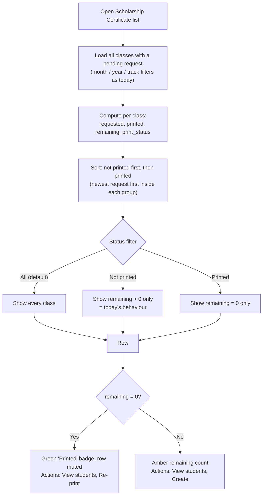
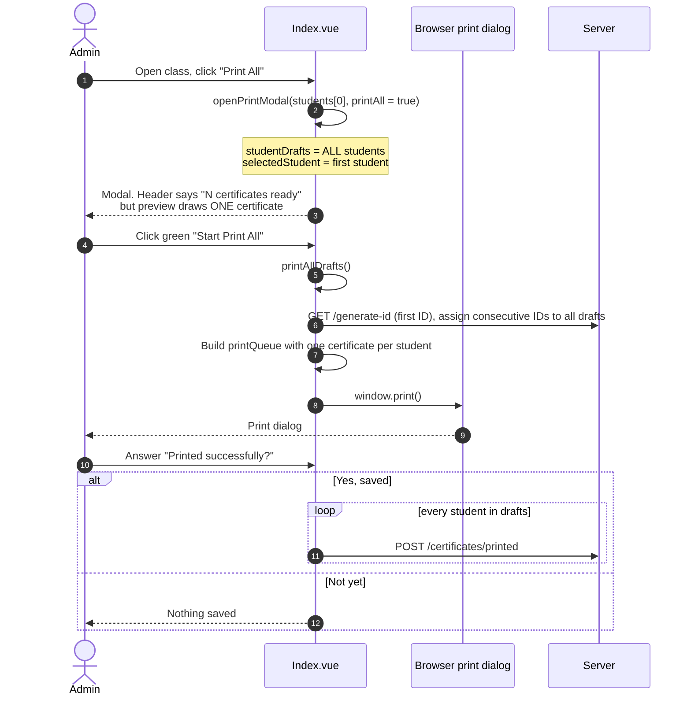
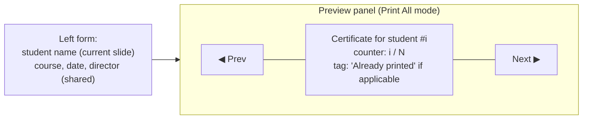

# Proposal: Scholarship Certificate Page Improvements

Status: **proposal only, no code changed.** Page: `/dashboard/certificates?type=scholarship`. File: [Index.vue](../resources/js/pages/backend/certificates/Index.vue).

| Part | Topic |
|---|---|
| [Part 1](#part-1-keep-printed-classes-in-the-list) | Keep printed classes in the list (status filter, printed badge) |
| [Part 2](#part-2-print-all-slider-preview-and-batch-printing) | Print All: slider preview, batch printing, skip already-printed students |
| [Part 3](#part-3-suggested-order-and-decisions) | Suggested order and decisions |

# Part 1: Keep Printed Classes in the List


## 1. Problem today

When the admin prints the last student of a class, that class **vanishes** from the list. It is removed by one line in the backend:

```php
// CertificateController::classes()  (line 107)
->filter(fn (array $studyClass): bool => $studyClass['remaining_students'] > 0)
```

Effects on the admin:

- No confirmation that the class is finished. It just disappears.
- To reprint a lost or damaged certificate, or check what was printed, they must go to the **Certificate Report** page, which is a different screen with different filters.
- The list can look empty even though work was done today.

## 2. Is your idea better UX?

**Yes.** Keep finished classes visible on the list, clearly marked as printed, and let the admin filter them. Two reasons it is also low-risk:

1. The list screen **already has UI for finished rows** that is currently unreachable: a green check on `remaining = 0` and a double-check `complete-mark` next to the row ([Index.vue:1874-1901](../resources/js/pages/backend/certificates/Index.vue#L1874-L1901)). The backend filter is what hides them.
2. The report endpoint already computes a `print_status` (`printed` / `not_printed`) with the same numbers, so the logic exists.

## 3. Proposed behaviour



### What the admin sees

| Column | Today (list) | Proposed |
|---|---|---|
| ID, Teacher, Course, Time | shown | unchanged |
| Requested at | report only | **add** |
| Printed | report only | **add** (`printed / requested`) |
| Remaining | shown | unchanged |
| Status | report only | **add** badge: Printed / Not yet (reuses existing labels) |
| Actions | View students, Create | unchanged; on printed rows show a "Re-print" style label |
| Filters | track, month, year | **add** status: All / Not yet / Printed |

## 4. Changes needed

### Backend, [CertificateController.php](../app/Modules/Certificate/Controllers/CertificateController.php)

1. In `classes()`, **remove** the `remaining_students > 0` filter (line 107).
2. Add `print_status` and `requested_at` to each row, and accept a `status` query param (`all|printed|not_printed`), validated with the existing `normaliseReportStatus()`.
3. Sort not-printed first.
4. `classes()` and `reportClasses()` both compute requested / printed / remaining / status. Move that into one private helper so the two screens can never disagree.

`whereRequestedCertificateClass()` stays as is (it only needs `status = 'pending'`, and that value never changes today).

### Frontend, [Index.vue](../resources/js/pages/backend/certificates/Index.vue)

1. Send a `status` param in `loadClasses()` for non-report pages, and add a status `<select>` next to the month/year filters. `reportStatusOptions` already has the options and translations.
2. Show the Requested at, Printed and Status columns for non-report pages too (drop the `v-if="isReport"` on those cells).
3. Fix **`openFirstClassForCreate()`** (line 449). It opens `filteredClasses[0]`; once printed classes stay in the list, that could be a finished one. Make it pick the first class with `remaining > 0`.
4. Check the summary counters at lines 194-196 (`totalRequested`, `totalPrinted`, `totalFinishedCourses`). They are defined but not used in the template today, so they are safe; if you later show them, `totalFinishedCourses` would need to count only rows with `remaining = 0`.

No migration, no new route, no new translation keys are needed.

## 5. Decisions for Part 1

1. **Default status filter.** Recommended: **All**, not-printed first, so finished classes are visible but do not push work down. Alternative: default to *Not yet* so the page behaves as today and *Printed* is one click away.
2. **Scope.** `classes()` serves free, normal, scholarship, meal, internship and office. The simplest and most consistent change is **all types**. Limiting it to scholarship only means a `type === 'scholarship'` special case; I do not recommend it unless the other types should keep hiding finished classes.
3. **Re-print on finished classes.** Keep the existing "Create" action but relabel it (Re-print) on printed rows, or hide it and rely on View students, where each student already has a Re-print button ([Index.vue:2024-2029](../resources/js/pages/backend/certificates/Index.vue#L2024-L2029)).

## 6. What the Report page is for afterwards

Still useful, and not duplicated: it covers **all types together** with a type filter. The scholarship list becomes a per-type working queue with history, and the report stays the cross-type overview.

## 7. Trade-offs

- The list grows over time. The month/year filters (year defaults to the current year) and the status filter keep it manageable; category pagination already exists.
- A class printed by mistake with the wrong filter is easy to spot now, which is a plus.
- If a later change makes `status` move past `pending` (for example `completed` after printing), `whereRequestedCertificateClass()` and the unblock action ([AddUnblockedStudentToPendingCertificateRequest.php](../app/Modules/Certificate/Actions/AddUnblockedStudentToPendingCertificateRequest.php), which only touches `pending` requests) would need to be updated. This proposal deliberately keeps the status derived to avoid that.

---

# Part 2: Print All, Slider Preview and Batch Printing


### 2.1 What you reported

After clicking **Print All**, the preview shows only the **first student**, not all students.

### 2.2 How Print All works today



Key points:

- **Preview is one certificate by design of the code.** The preview panel is bound to `currentCertificate`, a single object built from the left-hand form ([Index.vue:2167](../resources/js/pages/backend/certificates/Index.vue#L2167)). The header text "N certificates ready" is the only hint that more exist.
- **The real print list is separate.** `printAllDrafts()` builds `printQueue` with one certificate per student ([Index.vue:1666-1692](../resources/js/pages/backend/certificates/Index.vue#L1666-L1692)) and this queue is what `window.print()` prints.
- **Two different buttons.** Green **Start Print All** prints everyone. Purple **Print** (bottom right) prints only the previewed student ([Index.vue:2179](../resources/js/pages/backend/certificates/Index.vue#L2179)).
- **Already-printed students are included.** `studentDrafts` copies every student, so Print All reprints them and consumes new certificate IDs.
- **Records are saved only after you confirm.** The "Printed successfully?" prompt appears after the print dialog closes. **Yes, saved** marks every student in the batch as printed.

### 2.3 Problem A: preview shows one certificate

#### Proposed fix: slider (carousel) preview

Add prev / next arrows and a counter (`3 / 12`) over the preview. Each slide is one student's certificate.



Behaviour:

| Action | Result |
|---|---|
| Click Prev / Next (or ← → keys) | Move to another student's certificate |
| Edit name in the left form | Updates only the current slide's student |
| Edit course, granted date, director | Updates **every** slide (shared fields) |
| Move to another slide | The typed name is saved into that student's draft first, then the next student's name is loaded into the form |
| Start Print All | Prints every slide, in slide order |

Implementation outline:

1. Add `previewIndex` (ref, default 0). Reset to 0 in `openPrintModal()` and `closeModal()`.
2. Add `previewCertificate` computed: in Print All mode, `certificateFromStudent(studentDrafts[previewIndex])`; otherwise the existing `currentCertificate`.
3. On slide change: write `printForm.student_name` back into `studentDrafts[previewIndex].draft_name`, set `selectedStudent` to the new student, load its `draft_name` into `printForm.student_name`, and use that student's `certificate_id` (or the next generated one).
4. Change the preview `<component>` to use `previewCertificate` and add the arrow buttons.
5. Show the counter in the existing "N certificates ready" header.

No backend change. Single-student mode (purple Print, free and internship) is unchanged.

Certificate IDs: today the IDs are assigned only when printing starts (`assignDraftCertificateIds()`), so slides would show the same placeholder ID until then. Options: (a) assign IDs when the modal opens so each slide shows its real ID, or (b) keep assigning at print time and show the same preview ID. Recommendation: (a), but the IDs are then reserved only in the preview, and they are re-generated if you cancel and reopen, which is harmless.

### 2.4 Problem B: does "Start Print All" really print every certificate?

The **code intends to** (one certificate per student in `printQueue`, batch mode on). But I found a likely blocker that I have **not confirmed in a browser**:

The print CSS pins the print container to **one A4 page** with everything beyond it hidden ([Index.vue:629-644](../resources/js/pages/backend/certificates/Index.vue#L629-L644), and again in the static block near [Index.vue:4590](../resources/js/pages/backend/certificates/Index.vue#L4590)):

```css
#normal-cert-print { position: fixed; height: 297mm; max-height: 297mm; overflow: hidden; }
html, body        { height: 297mm; max-height: 297mm; overflow: hidden; }
```

The `batch-certificate-print` class only turns off the "hide everything after the first certificate" rules. It does not lift the one-page size limit. In batch mode this can clip the output to page 1, so the print dialog would show **1 page** instead of N.

#### How to check right now (before any fix)

1. Print All on a class with 3+ students.
2. In the browser print dialog look at the page count, or choose **Save as PDF** and open it.
3. **1 page** means the clipping bug is real. **N pages** means printing already works and only the preview needs the slider.

Do **not** click **Yes, saved** unless every page came out, because it marks all students as printed.

#### Proposed fix (only if the check shows 1 page)

In `beginNormalPrint(batch)`, when `batch` is true, use these rules instead of the fixed one-page sizes (the `html, body` rule is emitted by the same function, so it can be switched on `batch` directly):

```css
html, body { height: auto; max-height: none; overflow: visible; }   /* emitted only when batch = true */
body.batch-certificate-print #normal-cert-print {
    position: static; height: auto; max-height: none; overflow: visible;
}
```

Each certificate already has `page-break-after: always` and a fixed A4 height, so each student lands on its own page. Apply the same override in the static print block so both places agree.

#### Windows notes

- Chrome and Edge on Windows share the same engine as Chrome on Mac, so behaviour is expected to match. `window.print()` opens the browser's print dialog.
- Set **Paper: A4**, **Layout: Portrait** (free and internship use landscape), **Margins: None**. The page rule already asks for margin 0 and colors are forced on (`print-color-adjust: exact`).
- I have not tested printing on Windows. Please run the page-count check above on the actual Windows machine.

### 2.5 Problem C: Print All reprints already-printed students

`openPrintModal()` copies every student into `studentDrafts`, so students who already have a certificate are printed again and get new IDs.

Options:

| Option | Behaviour | Note |
|---|---|---|
| 1. Skip printed (recommended default) | Batch contains only `is_printed = false` students | Matches "print what is left". Add a checkbox "Include already printed" for reprints |
| 2. Include all, warn | Keep today's behaviour, show "5 already printed will be reprinted" | Least code, easy to reprint by accident |
| 3. Ask each time | Confirm dialog with the count before printing | Extra click every time |

If all students are already printed, Option 1 should disable the button and point to the per-student **Re-print** buttons instead.

---

# Part 3: Suggested order and decisions

## Suggested order

1. Run the **page-count check** (Part 2, section 2.4) on the Windows machine. It decides whether the batch CSS fix is needed.
2. Part 1: keep printed classes in the list (backend filter removal, status filter, extra columns, `openFirstClassForCreate()` fix).
3. Part 2: slider preview (front-end only).
4. Part 2: batch CSS fix, only if step 1 shows 1 page.
5. Part 2: skip already-printed students by default.

Both parts touch [Index.vue](../resources/js/pages/backend/certificates/Index.vue). Part 1 also touches `CertificateController::classes()`.

## Decisions for you

**Part 1** (also listed in section 5): default status filter (All or Not yet), scope (all types or scholarship only), and Re-print label on finished rows.

**Part 2:**
1. Slider preview OK as described, or a scrollable list of all certificates instead?
2. Certificate IDs: show the real ID on each slide (option a) or assign at print time (option b)?
3. Already-printed students: skip by default with an "Include already printed" checkbox (recommended), or keep including them?
4. Page-count check result on your machine: 1 page or N pages?
