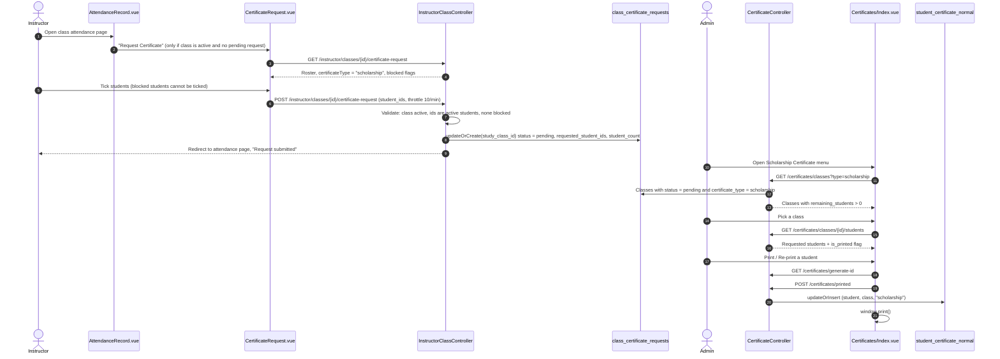
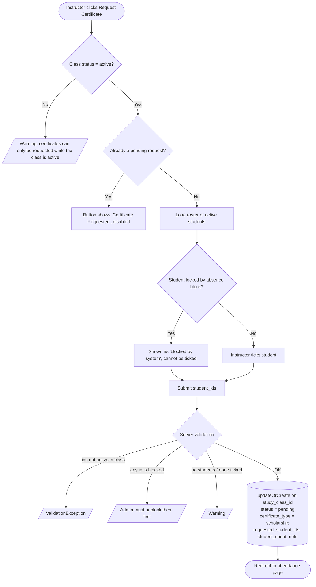
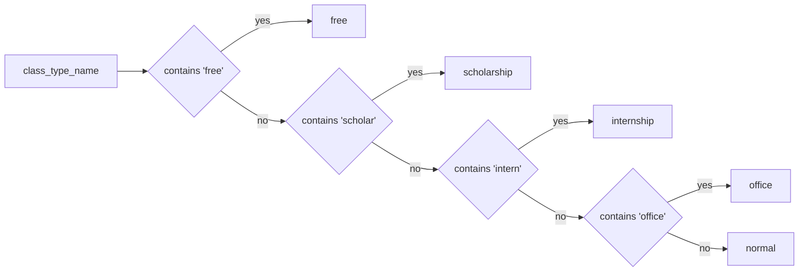
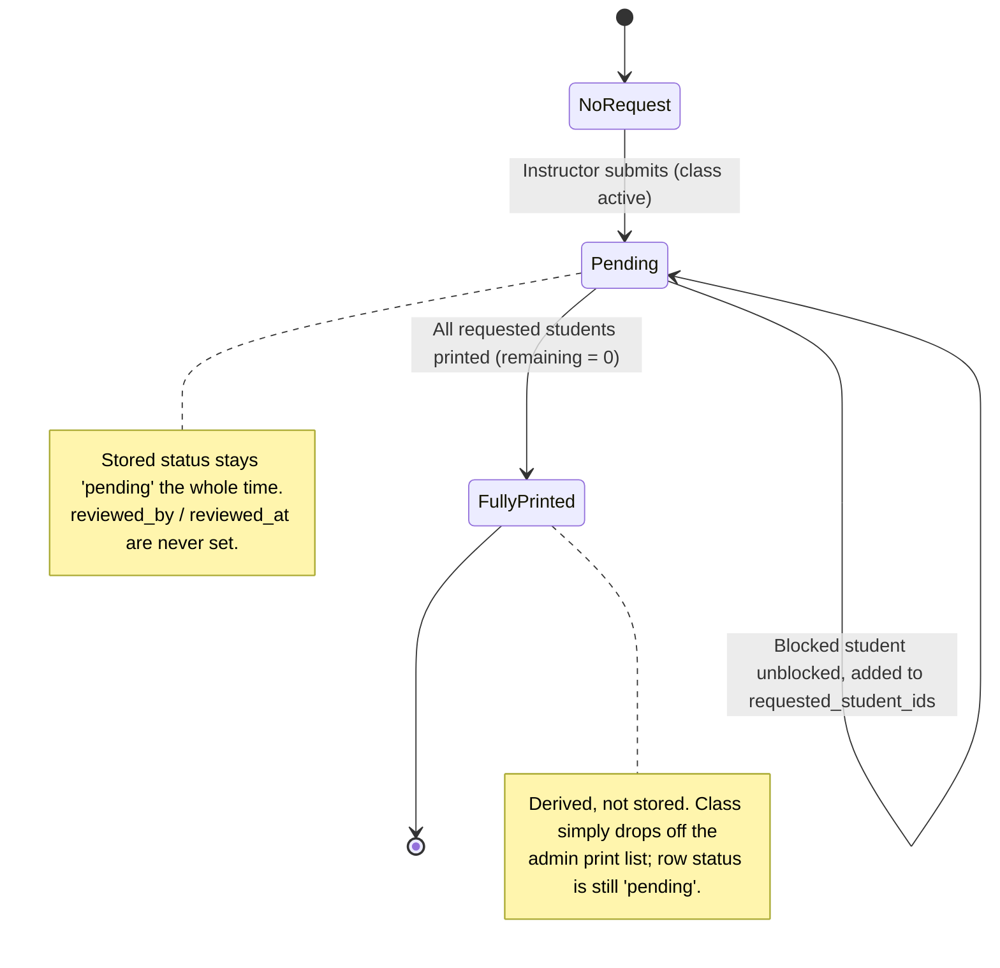
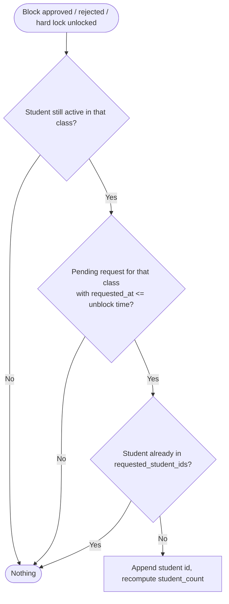
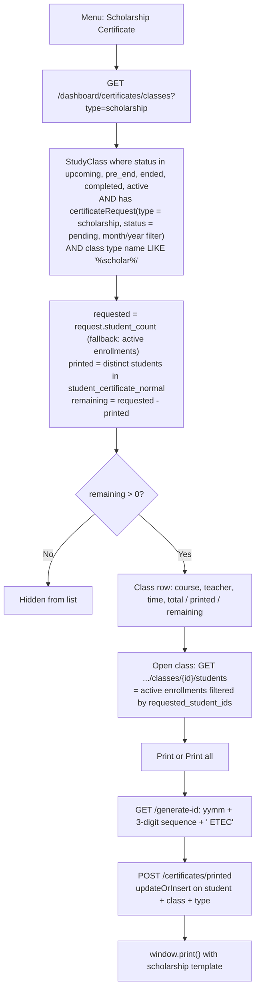
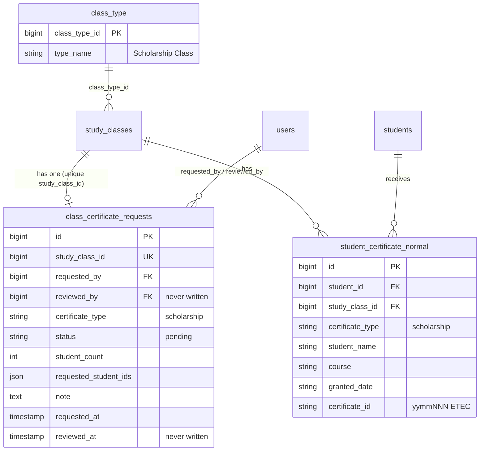

# Scholarship Class Certificate Request

Summary of how a **Scholarship Class** gets its certificates: the instructor requests, the admin prints. Diagrams are Mermaid (render in GitHub, VS Code Markdown Preview, etc.).

## 1. Overview

| | |
|---|---|
| **Who requests** | The class's instructor (owner or shared), from the class attendance page |
| **Who prints** | `super_admin` / `admin` (and `instructor`, same route group) at `/dashboard/certificates?type=scholarship` |
| **When a request is allowed** | Class status is `active` only |
| **Which students** | Active enrolled students the instructor ticks, minus any student who is attendance-blocked |
| **Output** | A "Certificate of Completion" with the scholarship layout (navy corner dots), saved per student in `student_certificate_normal` |

A class is treated as *scholarship* when its class type name contains `scholar` (seeded as `Scholarship Class`, `class_type_id = 5`). Everything else (free / internship / office / normal) follows the same pipeline with a different `certificate_type` value.

## 2. End-to-end flow

## 3. Instructor-side rules (request submission)

## 4. Certificate type detection

Class type name (from `class_type.type_name`) is lower-cased and checked **in this order**, first match wins:

Implemented in `certificateTypeForClass()` ([InstructorClassController.php:710](../app/Modules/Instructor/Controllers/InstructorClassController.php#L710)) and duplicated in `certificateRequestTypeForClass()` ([InstructorClassService.php:990](../app/Modules/Instructor/Services/InstructorClassService.php#L990)). The admin list filters with `type_name LIKE '%scholar%'` ([CertificateController.php:25-30](../app/Modules/Certificate/Controllers/CertificateController.php#L25-L30)).

## 5. Request lifecycle

### Unblocking a student after the request was sent

When an absence block is approved, rejected, or a hard lock is unlocked, [AddUnblockedStudentToPendingCertificateRequest](../app/Modules/Certificate/Actions/AddUnblockedStudentToPendingCertificateRequest.php) runs:

The `requested_at <= unblock time` check means a *later* request where the instructor deliberately left the student out is not altered.

## 6. Admin print screen

`Certificate Report` (`?type=report`) reads the same `class_certificate_requests` rows and shows `printed` / `not_printed` per class, filterable by type, track, month and year.

## 7. Data model

## 8. Scholarship-specific behaviour

The only difference from other types is the visual template: `certificate_type === 'scholarship'` adds the `scholarship-certificate-preview` class and four navy (`#2d2e81`) corner dots on the border ([CertificatePreview.vue:12](../resources/js/pages/backend/certificates/CertificatePreview.vue#L12), [Index.vue:2318](../resources/js/pages/backend/certificates/Index.vue#L2318)). Wording, ID format, signatory and print flow are the same as the normal certificate.

## 9. Key files

| Layer | File |
|---|---|
| Instructor request page | [CertificateRequest.vue](../resources/js/pages/backend/instructors/CertificateRequest.vue) |
| Request button / status badge | [AttendanceRecord.vue:504](../resources/js/pages/backend/instructors/AttendanceRecord.vue#L504) |
| Request routes | [instructor.php:36-39](../routes/web/backend/instructor.php#L36-L39) |
| Request creation | `storeCertificateRequest()` in [InstructorClassController.php:350](../app/Modules/Instructor/Controllers/InstructorClassController.php#L355) |
| Admin routes | [certificate.php](../routes/web/backend/certificate.php) |
| Admin list / students / print save | [CertificateController.php](../app/Modules/Certificate/Controllers/CertificateController.php) |
| Admin UI + templates | [Index.vue](../resources/js/pages/backend/certificates/Index.vue), [CertificatePreview.vue](../resources/js/pages/backend/certificates/CertificatePreview.vue) |
| Unblock re-add | [AddUnblockedStudentToPendingCertificateRequest.php](../app/Modules/Certificate/Actions/AddUnblockedStudentToPendingCertificateRequest.php) |
| Models | [ClassCertificateRequest.php](../app/Models/ClassCertificateRequest.php), [StudentCertificateNormal.php](../app/Models/StudentCertificateNormal.php) |
| Migrations | `2026_08_29_000001`, `2026_08_30_000001`, `2026_09_02_000001` (certificate tables, requests, `requested_student_ids`) |

## 10. Things worth knowing (observed in code, not changed)

1. **No approval step.** The instructor UI says "for super admin review", but nothing sets `status` beyond `pending` or writes `reviewed_by` / `reviewed_at`. The admin prints directly. A fully printed class only disappears from the list because `remaining_students` hits 0.
2. **A pending request can never be re-submitted from the UI**, and since status never leaves `pending`, an instructor cannot request again for the same class (for example to add a student left out) without a DB edit. The unblock action is the only thing that grows `requested_student_ids` afterwards.
3. **One request per class.** `study_class_id` is `unique` and the write is `updateOrCreate` on it, so there is no per-type history.
4. **Legacy path.** `requestCertificate()` ([InstructorClassController.php:232](../app/Modules/Instructor/Controllers/InstructorClassController.php#L232)) and `certificate_class_requests` / `CertificateClassRequest` have no route pointing at them and the admin screens never read that table.
5. **Empty `requested_student_ids` means all.** `students()` only filters by requested IDs when the list is non-empty; otherwise every active enrollee is shown.
6. **Type detection is duplicated** in the controller, the service and the admin keyword filter. A class type named e.g. "Free Scholarship" resolves to `free` because `free` is checked first.
7. **Certificate IDs share one sequence** across all types (`student_certificate_normal.certificate_id`, `yymm` + 3 digits + ` ETEC`), generated with a read-then-increment and no lock.
8. **Report and list year filter** is clamped to 2018 through the current year.
