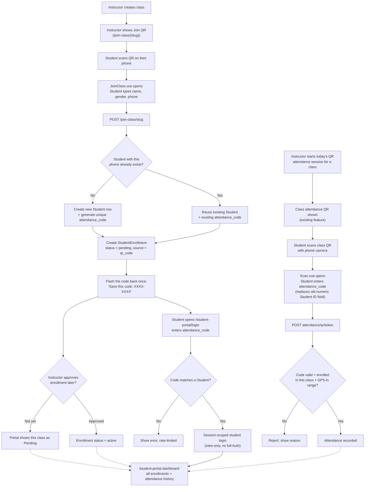

# Student Portal + Unique Code — Proposal

The **same code doubles as a login credential** for a new student-facing portal, and as the identifier used during QR attendance scan-in.

## What you asked for

> Student can create an account to view their attendance and track attendance, but to register they must already be enrolled. When an instructor creates a class, they show a QR for students to join — at that moment the student types their info. I want that moment to generate a unique code that logs them in to view attendance for every class they have, and to use for scanning attendance.

## What already exists (grounding this in the real code, not assumptions)

- **The "join class" QR flow you're describing already exists**: `ClassJoinController::create`/`store` (`app/Modules/Website/Controllers/ClassJoinController.php:17-75`), reached at `GET/POST /join-class/{studyClass:slug}`. Instructor shares/shows this QR, student opens `JoinClass.vue`, types name/gender/phone, submits.
- On submit, `StudentRegistrationService::findOrCreatePublicStudent()` creates (or reuses, matched by phone) a row in the `students` table, then `createPendingEnrollment()` creates a `StudentEnrollment` with `enrollment_status: 'pending'`, `source: 'qr_code'`.
- An instructor later approves it via `EnrollmentClassController::approveEnrollment()` (`app/Modules/EnRoll/Controllers/EnrollmentClassController.php:674-719`), which flips `enrollment_status` to `'active'`.
- **There is currently no student login/portal at all.** None of the self-registration flows (`ClassJoinController`, `StudentRegisterController`) create a `User` account, set a password, or call `Auth::login()` — they only ever write to the `students` table. A `student` role exists in the permission system (used only when an admin manually creates a `User` via User Management), but there's no dashboard built for it.
- **Closest existing prior art**: `StudentEnrollment::uniquePublicToken()` (`app/Models/StudentEnrollment.php:58-70`) auto-generates a 40-char opaque token per enrollment for a no-login public status page. That's per-*enrollment*, one-off, not human-typeable, and not meant as a login credential — but it proves the codebase already has a pattern for "give this row a unique lookup token."

So: what you're asking for is a genuinely new capability, not a small tweak — but it slots cleanly onto existing pieces.

## Proposed design

### 1. One code per student, minted the first time they're seen

Hook into `StudentRegistrationService::findOrCreatePublicStudent()` / `createStudent()` — the single place both `ClassJoinController` and `StudentRegisterController` funnel through to create a `Student` row. When a **new** student row is created (not when an existing one is reused by phone — that's what keeps it "one code, many classes"), generate and store a unique `attendance_code` right there. This means:

- Add `attendance_code` (string, unique, indexed) to the `students` table.
- Generate it as a short, human-typeable code (e.g. 8 chars, uppercase letters + digits, ambiguous characters like `0/O`, `1/I` excluded) — unlike the enrollment's 40-char opaque token, this one needs to be *readable off a phone screen and typed back in*.
- Because it lives on `students`, not `student_enrollments`, the same code covers every class that student ever joins — including classes they join later. That's the "one code, many classes" part.

### 2. Show it once, right at join time

On successful submission of the join form (`ClassJoinController::store`), flash the code back to `JoinClass.vue`'s success screen: *"Save this code — it's how you log in to check your attendance: **XXXX-XXXX**."* This mirrors the existing `enrollment_id` flash pattern already used in the public class-registration flow (`HandleInertiaRequests::share()` explicitly whitelists flash keys — `attendance_code` would need to be added there too).

Because the enrollment itself starts `pending`, the portal should show "pending approval" for that class until an instructor approves it — same status concept `JoinClass.vue` already shows via `isLocked`.

### 3. A minimal student portal

- `GET /student-portal/login` — single field, the code. Looks up `students.attendance_code`, sets a lightweight session flag (`session(['student_id' => $student->id])`) — **not** a full Laravel `Auth::login()`, since there's no `User`/password model backing these self-registered students today. A dedicated middleware checks that session key to protect portal routes.
- `GET /student-portal` — dashboard: list of the student's enrollments (`student_enrollments` where `student_id`), each with class title/instructor/schedule and a rollup of their `student_attendance` rows (present/absent count, last check-in time). This reuses the same query shape as the existing per-enrollment public status page — just aggregated across all of the student's enrollments instead of one.

**This needs a call from you before I build it**: should this be a real login (create a `User` + role `student`, go through the existing `AuthController`/session/permission system) or a lightweight code-only session as sketched above? Real login is more consistent with the rest of the app's auth model and easier to extend later (password reset, etc.); the lightweight version is faster to ship and doesn't touch the main auth system at all. I'd lean lightweight for a v1, since nothing about "view my own attendance" needs the permission system's role/ability machinery.

### 4. Reuse the same code for QR attendance scan-in

This is where it connects to the earlier proposal: on `Scan.vue`, replace the plain numeric "Student ID" field with the same `attendance_code`. `AttendanceQrController::store` looks the student up by code instead of by raw ID before checking enrollment — identical logic to Option A in the prior doc, just now the code has a second job (portal login) instead of being single-purpose.

One code → login to the portal, and → attendance check-in. No separate systems to maintain.

## Security notes

- The code is now a de facto password with **no second factor** (no email/phone verification step exists in this flow today). It needs real brute-force protection: throttle the portal login endpoint hard (e.g. Laravel's `RateLimiter`, lock out after ~5 attempts per IP/code), and store the code hashed (like a password) rather than plaintext, comparing via `Hash::check()`.
- Once shown at join time, there's no "forgot my code" self-service recovery unless we add phone-based OTP (not present anywhere in this codebase today) — realistically, recovery should be an admin action (registrar looks up the student, issues a new code) for v1.
- QR scan-in keeps its existing GPS + device-fingerprint checks regardless of this change — the code only replaces *how the student is identified*, not the anti-fraud layer around it.

## Flow chart

## Open questions before implementation

1. **Real `User`-backed login vs. lightweight code-only session** — see point 3 above. This is the biggest fork; it changes how much of the app it touches.
2. Should the code be shown **only once** at join time (student must save it, no way to view it again except asking an admin), or should it also be visible somewhere they can look it up later (e.g. on the enrollment receipt, or resurfaced if they log into the portal)?
3. Multiple pending joins before approval: if a student joins two different classes via two different class QR codes before either is approved, should the portal show both as "pending," or should the second join reuse the first's code silently (it will, since lookup is by phone) — just confirming the UX you want here.
4. Do you want this to fully replace the numeric Student ID field on the scan page immediately, or run both in parallel for a transition period?
